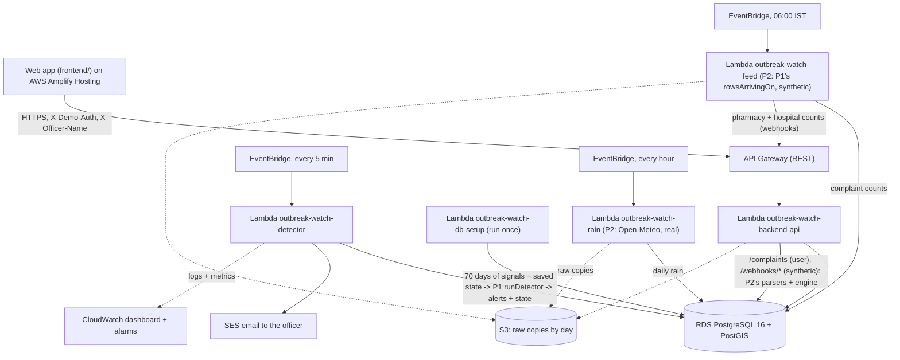

# Outbreak Watch: Bengaluru outbreak early warning

Waterborne outbreaks in Indian cities are usually noticed late: by the time hospitals see a
cluster, a contaminated pipe has been feeding a neighbourhood for days or weeks. The early signs
are already there, scattered across citizen complaints, pharmacy sales of rehydration salts and
anti-diarrhoeals, hospital visits and heavy rain, but nobody watches them together, ward by ward.
Outbreak Watch watches those daily signals for all 243 wards of Bengaluru, flags wards that look
unusual, gives a likely cause (water, food, person to person, seasonal) and the suspected water
supply zone, and emails the health officer, who works the alert in the web app.

**Live app:** https://main.d2vyoxrra6j7bc.amplifyapp.com (the demo key for Reset/Inject is in the submission text)

> **SUSPECTED, NOT CONFIRMED.** Alerts are statistical early warnings, not confirmed
> outbreaks. The cause is a **triage hint, not a diagnosis**. An officer must check in the field.

## Run it in 2 minutes (Windows or Mac)

You need Node 20+ and git.

```
git clone https://github.com/prathignas/outbreak-watch-water_safety.git
cd outbreak-watch-water_safety
npm install
cp .env.example .env        # Windows cmd: copy .env.example .env   (PowerShell: Copy-Item .env.example .env)
npm run dev
```

Open http://localhost:5173. This is mock mode: the whole system (simulated city, detector and
classifier) runs in the browser, so you need no database, Docker or AWS account.

## How AWS is used (ap-south-1)

| Service | What it does here |
|---|---|
| **AWS Lambda** (5 functions, Node 22) | `api` (the REST API), `detector` (every 5 minutes), `rain` (real rain, every hour), `feed` (daily simulated pharmacy/hospital/complaint counts), `db-setup` (migrations and seed, run once) |
| **Amazon API Gateway** | One HTTPS REST front door for the web app, the Report form and the webhooks |
| **Amazon EventBridge** | The three schedules: detector every 5 min, rain hourly, feed daily at 06:00 IST |
| **Amazon RDS PostgreSQL + PostGIS** | Signals, alerts, detector state, the real ward and water-zone boundaries |
| **AWS Secrets Manager** | The database password |
| **AWS Systems Manager Parameter Store** | The demo key and the webhook secret (read at deploy time), the alert email addresses |
| **Amazon SES** | The alert email to the officer (sandbox: sender and recipient verified) |
| **Amazon CloudWatch** | Logs, a dashboard, metrics and alarms (e.g. rain not fetched for 3 hours) |
| **AWS Budgets** | $30 a month budget with an email at 80% |
| **Amazon S3** | Raw copies of every Open-Meteo answer, feed batch and webhook, by day |
| **AWS Amplify Hosting** | Builds the web app from this repo and serves it (the live link above). Not CloudFront: the stack has a CloudFront option, off by default (`-c cloudfront=true`) |
| **AWS CDK** | The whole backend stack in one TypeScript file, `infra/src/outbreak-stack.ts` |

## What is real and what is simulated

| Data | Real or simulated |
|---|---|
| Health signals: pharmacy sales, hospital visits, complaint counts | **Simulated** (our generator, with planted outbreaks) |
| Reports sent through the Report form (`/report`) | **Real** (stored as `user` rows) |
| Rainfall | **Real** (Open-Meteo, hourly) |
| Ward boundaries (243) and BWSSB water-zone boundaries (43) | **Real** |
| Alerts, relative risk, cause hint | Computed by the real detector and classifier from the data above |

## Honest limits

- The demo has **no officer login**: anyone can acknowledge, resolve or add a note. Only Reset and Inject need the demo key.
- The **database is publicly reachable** for the demo (password-protected, but open to the internet). A real deployment would put it in private subnets.
- The cause label is a **triage hint**, not a diagnosis.
- Health **signals are simulated**; we have no real pharmacy or hospital feed.
- **Backtest numbers are on simulated outbreaks**, not real ones.

## Credits: data sources and licences

- Ward boundaries: **DataMeet** India community, Bangalore Municipal Spatial Data (`BBMP.geojson`), CC BY-SA 2.5 India (as stated in DataMeet's Readme).
- Water zones: **BWSSB** sub-division boundaries via **OpenCity**, source **KSRSAC** (credit Vaidyanathan R), listed as Public Domain on OpenCity.
- Food venues and map data: © **OpenStreetMap** contributors, ODbL. Map tiles: OpenFreeMap / OpenMapTiles.
- Rainfall: **Open-Meteo** (archive and forecast APIs), CC BY 4.0.

Details and checks: `detection/data/SOURCES.md`.

## Folders

| Folder | Owner | What |
|---|---|---|
| `detection/` | P1 | The detectors, cause classifier, live-data generator and backtest. Package `@outbreak/detection` |
| `pipeline/` | P2 | Data ingestion: real rain, the daily synthetic feed, webhooks, complaints. Package `@outbreak/pipeline` |
| `frontend/` | P2 | The web app (Vite + React). See `frontend/README.md` for every API route |
| `backend/` | P3 | API Lambda, detector run, database, SES email |
| `infra/` | P3 | AWS CDK stack |
| `packages/contract/` | all | Shared types: P1's `types.ts` re-exported, plus contract-v2 shapes |
| `docs/` | all | `contract.md`, `INTEGRATION-PLAN.md`, `STATUS-P3-FIX.md`, `STATUS-P2-FIX.md` |

## How it fits together (AWS, ap-south-1)



Picture version: `docs/architecture.svg` / `docs/architecture.png`. The web app is hosted on AWS Amplify Hosting, outside the CDK stack.

- **The detector.** It runs P1's `runDetector` for each India day that has not run yet. Once
  today has run, each 5-minute run reloads the state saved at the end of yesterday and
  recomputes today, so rows that arrive during the day are used. An alert that already exists
  is updated, not emailed again.
- **Ingestion.** Every signal write (rain, feed, webhooks, complaints) goes through P2's
  parsers and engine and the backend's `insertSignals` (`backend/src/ingest.ts`). Webhooks
  need the `X-Webhook-Secret` header.
- **Demo actions.** A demo inject or reset re-runs the detector at once.

## Run it locally

You need Node 20+ and PostgreSQL with PostGIS.

```bash
npm install
DATABASE_URL=postgres://user@localhost:5432/outbreak_watch npm run db:setup    # tables + seed
# API on http://localhost:3001:
DATABASE_URL=... DEMO_AUTH_TOKEN=<any demo key> SES_MOCK=true npm run api:local --workspace=@outbreak/backend
# Web app against it:
cd frontend && npm install && VITE_API_MODE=real VITE_API_BASE_URL=http://localhost:3001 npm run dev
```

| Variable | What |
|---|---|
| `DATABASE_URL` | Local database. In AWS: `DB_SECRET_ARN` (the RDS secret) instead |
| `DEMO_AUTH_TOKEN` | The demo key for Reset and Inject (`X-Demo-Auth`). No default: unset means Reset and Inject are refused |
| `SES_FROM_EMAIL`, `OFFICER_EMAIL` | Alert email sender and recipient. Both must be verified in the SES sandbox |
| `SES_MOCK=true` | Log emails instead of sending them |
| `AWS_REGION` | Default `ap-south-1` |

## Tests

```bash
npm test                     # cdk synth, then every workspace: detection, contract, backend, infra
npm run typecheck            # tsc for packages/contract, backend and infra
TEST_DATABASE_URL=postgres://user@localhost:5432/outbreak_test npm test --workspace=@outbreak/backend   # also against real PostgreSQL
```

## Deploy to AWS and reset the demo

See `infra/README.md` for the full steps and the known limits. In short:

```bash
aws ssm put-parameter --region ap-south-1 --name /outbreak/demo-auth-token --type String --value '<your demo key>'
SES_FROM_EMAIL=<sender> OFFICER_EMAIL=<officer> npm run deploy
aws lambda invoke --function-name outbreak-watch-db-setup --region ap-south-1 --cli-read-timeout 310 db-setup.json && cat db-setup.json
curl -X POST "$API_URL/demo/reset" -H "X-Demo-Auth: <your demo key>"
```
